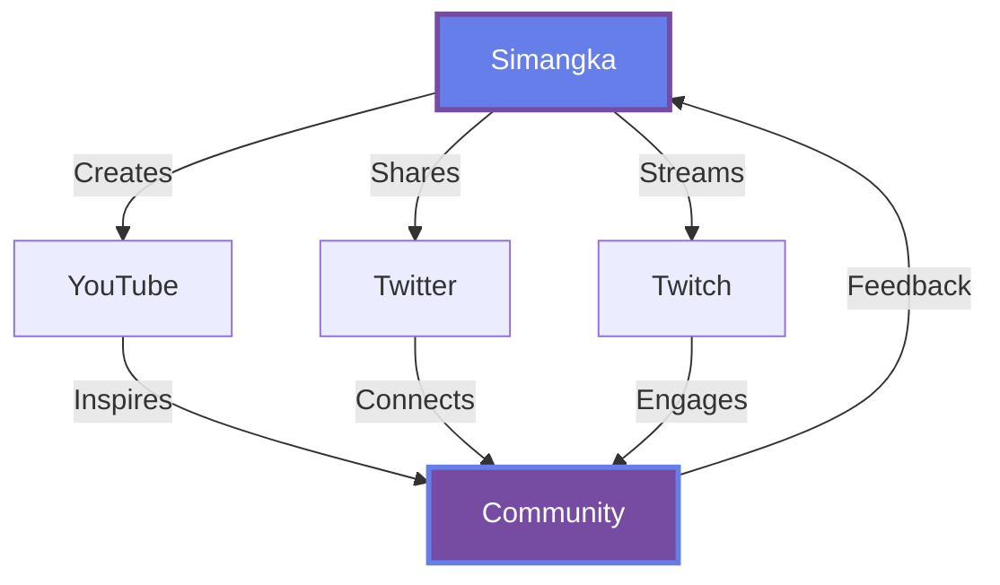

<div align="center">

```
╔═══════════════════════════════════════════════════════════════════════════════╗
║                                                                               ║
║   ███████╗██╗███████╗██╗  ██╗ █████╗ ███╗   ██╗ ██████╗ ██╗  ██╗ █████╗    ║
║   ██╔════╝██║██╔════╝██║ ██╔╝██╔══██╗████╗  ██║██╔════╝ ██║ ██╔╝██╔══██╗   ║
║   ███████╗██║███████╗█████╔╝ ███████║██╔██╗ ██║██║  ███╗█████╔╝ ███████║   ║
║   ╚════██║██║╚════██║██╔═██╗ ██╔══██║██║╚██╗██║██║   ██║██╔═██╗ ██╔══██║   ║
║   ███████║██║███████║██║  ██╗██║  ██║██║ ╚████║╚██████╔╝██║  ██╗██║  ██║   ║
║   ╚══════╝╚═╝╚══════╝╚═╝  ╚═╝╚═╝  ╚═╝╚═╝  ╚═══╝ ╚═════╝ ╚═╝  ╚═╝╚═╝  ╚═╝   ║
║                                                                               ║
║                        『 ENGINEER · CREATOR · BUILDER 』                       ║
║                                                                               ║
╚═══════════════════════════════════════════════════════════════════════════════╝
```

</div>

<br>

<div align="center">
  
</div>

<br>

## 🧬 DNA Sequence

<table>
<tr>
<td width="50%">

### 📡 Signal Output

```python
class Simangka:
    def __init__(self):
        self.location = "Kathmandu, Nepal 🏔️"
        self.coordinates = (27.7172°, 85.3240°)
        self.timezone = "NPT (UTC+5:45)"
        
    def broadcast(self):
        channels = {
            'video': self.youtube(),
            'thoughts': self.twitter(),
            'live': self.twitch()
        }
        return channels
    
    def current_state(self):
        return {
            'status': 'Building',
            'mode': 'Deep Work',
            'coffee_level': 0.87,
            'curiosity': float('inf')
        }
```

</td>
<td width="50%">

### 🎯 Mission Parameters

<br>

```yaml
primary_directive: |
  Build tools that don't just work,
  but make people wonder "how?"

core_beliefs:
  - Code is communication
  - Design is invisible
  - Complexity hides in simplicity
  
current_obsessions:
  - Systems thinking
  - Emergent behavior
  - Beautiful abstractions
  
success_metric: |
  "Did I learn something that 
   changed how I see the world?"
```

</td>
</tr>
</table>

<br>

## 🌐 Network Topology

<div align="center">



<br>

### 📍 Connection Points

<a href="https://www.youtube.com/@simangka">
  
</a>
<a href="https://x.com/simangkaupreti">
  
</a>
<a href="https://twitch.com/simangka">
  
</a>

<br><br>


</div>

<br>

## 💭 Philosophy Engine

<div align="center">

| Principle | Implementation | Result |
|-----------|---------------|--------|
| **Occam's Razor** | Simplest solution wins | Elegant code |
| **First Principles** | Question everything | Novel approaches |
| **Feynman Technique** | If you can't explain it simply... | Deep understanding |
| **Parkinson's Law** | Work expands to fill time | Ship fast |
| **Lindy Effect** | Time-tested > trendy | Solid foundations |

</div>

<br>

## 🔬 Lab Notes

<details>
<summary>📊 What I'm researching</summary>

<br>

- **Systems Thinking**: How small changes create large effects
- **Human-Computer Interaction**: The invisible interface
- **Information Theory**: Signal vs. noise in the digital age
- **Emergent Complexity**: Simple rules, complex outcomes
- **Cognitive Load Theory**: Making the difficult feel effortless

</details>

<details>
<summary>🛠️ Current experiments</summary>

<br>

```javascript
const experiments = [
  {
    name: "Building in public",
    hypothesis: "Transparency accelerates learning",
    status: "ongoing",
    findings: "Vulnerability == strength"
  },
  {
    name: "Cross-pollination",
    hypothesis: "Best ideas live between domains",
    status: "observing",
    findings: "Physics + Design + Code = Magic"
  },
  {
    name: "Async collaboration", 
    hypothesis: "Geography is irrelevant",
    status: "validating",
    findings: "Internet is still underrated"
  }
];
```

</details>

<details>
<summary>📚 Knowledge Graph</summary>

<br>

```
           ┌─────────────┐
           │   Physics   │
           └──────┬──────┘
                  │
        ┌─────────┴─────────┐
        │                   │
   ┌────▼────┐         ┌────▼────┐
   │  Math   │         │ Design  │
   └────┬────┘         └────┬────┘
        │                   │
        └─────────┬─────────┘
                  │
           ┌──────▼──────┐
           │    Code     │◄────── You are here
           └─────────────┘
                  │
           ┌──────▼──────┐
           │   Systems   │
           └─────────────┘
```

</details>

<br>

## 🎨 Aesthetic Function

<div align="center">

```
   "Form follows function - that has been misunderstood.
    Form and function should be one, joined in a spiritual union."
                                                  — Frank Lloyd Wright
```

<br>

**My interpretation:**

*Beautiful code isn't decorated code.*  
*It's code where every line belongs.*  
*Where you can't remove anything without losing something.*  
*Where the structure itself is the art.*

</div>

<br>

## 📈 Metrics That Matter

<div align="center">

```ascii
  Bugs Fixed         Lines Deleted      Questions Asked      Minds Changed
      ███                 ████                 █████               ██
       ▓                   ▓▓                   ▓▓▓                ▓
       ▒                   ▒▒                   ▒▒▒                ▒
       ░                   ░░                   ░░░                ░
  
   "Good"             "Better"            "Best"          "Winning"
```

</div>

<br>

## 🌌 The Bigger Picture

<div align="center">

<table>
<tr>
<td align="center" width="33%">

### 🎯 Today
Building one thing  
really well

</td>
<td align="center" width="33%">

### 🚀 This Year  
Systems that  
compound value

</td>
<td align="center" width="33%">

### 🌟 Long Game
Ideas that outlive  
the code

</td>
</tr>
</table>

</div>

<br>

## 💌 Final Transmission

<div align="center">

```
╔════════════════════════════════════════════════════════════════╗
║                                                                ║
║  If you're reading this, you're curious.                      ║
║  That's the most valuable trait in the universe.              ║
║                                                                ║
║  Let's build something that makes the world                   ║
║  slightly more interesting.                                   ║
║                                                                ║
║  —S                                                            ║
║                                                                ║
╚════════════════════════════════════════════════════════════════╝
```

<br>


---

<sub>Built with curiosity, caffeine, and vim</sub>

</div>
